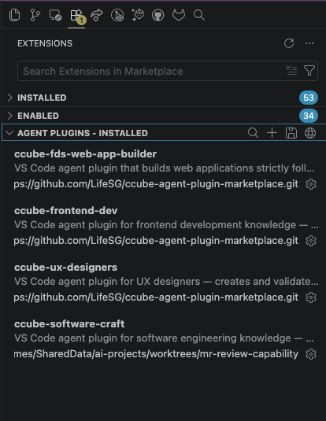
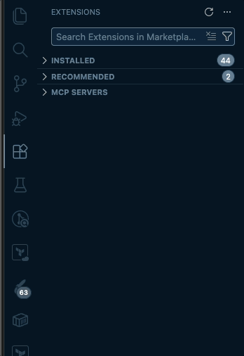
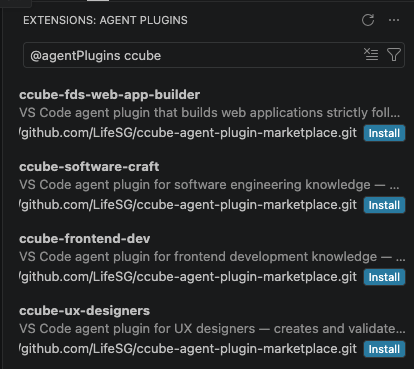

<div align="center">

<h1>
  
  CCube Copilot Plugin Marketplace
</h1>

*A curated collection of GitHub Copilot agent plugins for the Singapore Government digital ecosystem*


<p align="center">
  <a href="plugins/"></a>
</p>

</div>

---

## About

This repository is a marketplace of GitHub Copilot agent plugins. Each plugin
ships a curated set of customization files — agents, instruction files, prompts,
and skills — that are installed directly into a user's VS Code workspace.

Plugins are independent and self-contained. Install only the ones relevant to
your project.

---

## Plugins

| Plugin                                                          | Description                                                                                                                                                                                                                      |
| --------------------------------------------------------------- | -------------------------------------------------------------------------------------------------------------------------------------------------------------------------------------------------------------------------------- |
| [ccube-fds-web-app-builder](plugins/ccube-fds-web-app-builder/) | Turns Copilot into an AI web app developer that builds React applications strictly following the [Flagship Design System (FDS)](https://designsystem.life.gov.sg/react/index.html?path=/docs/getting-started-installation--docs) |
| [ccube-frontend-dev](plugins/ccube-frontend-dev/)               | VS Code agent plugin for frontend development knowledge — React 18/19 patterns, React fundamentals, CSS essentials, and styled-components best practices                                                                         |
| [ccube-software-craft](plugins/ccube-software-craft/)           | Brings principal-level software engineering knowledge into Copilot — architecture decisions, system design, clean code, git workflow, EP authoring, and markdown standards                                                       |
| [ccube-ux-designers](plugins/ccube-ux-designers/)               | Gives Copilot the knowledge to create validated `DESIGN.md` files by browsing live design system documentation directly in the integrated browser                                                                                |

---

## Installation

### Prerequisites

**Do you work at GovTech?**

If yes, you must complete the Copilot licence signup before continuing:
[Sign up for agentic AI coding tools (without MCP)](https://docs.developer.tech.gov.sg/docs/ai-coding-assistants/sign-up-for-agentic-tools-without-mcp)

If you do not work at GovTech, skip this and go straight to Step 1.

---

### Step 1 — Register this marketplace in VS Code

This step tells VS Code where to find the CCube plugins. You only need
to do this once.

1. Open the Command Palette:
   - Mac: **Cmd + Shift + P**
2. Type `Open User Settings JSON` and press **Enter**
3. You will see a file with curly braces `{ }`. Add the following block
   inside the outermost `{ }`. If the file already has other settings,
   add a comma after the last existing entry before pasting this:
   ```json
   "chat.plugins.marketplaces": [
     "https://github.com/LifeSG/ccube-agent-plugin-marketplace.git"
   ]
   ```
   When done, the relevant part of your file should look like this:
   ```json
   {
		.........
     "some.existing.setting": true,
     "chat.plugins.marketplaces": [
       "https://github.com/LifeSG/ccube-agent-plugin-marketplace.git"
     ]
   }
   ```
4. Save the file (**Cmd + S**)

You should see no error highlighting in the file. If VS Code shows a
red underline, check that every line ends with a comma except the last
entry before a closing `}` or `]`.

---

### Step 2 — Install individual plugins

If you have never enabled agent plugins before, you need to turn the
feature on first.

2. Open the Command Palette:
   - Mac: press **Cmd + Shift + P**
3. Type `Open User Settings JSON` and press **Enter** — a file called
   `settings.json` opens
4. Find the closing `}` at the very end of the file. Place your cursor
   on the line just above it and add the following line. If the line
   above already ends with `}` or `]`, add a comma first:
   ```json
   "chat.plugins.enabled": true
   ```
5. Save the file (**Cmd + S** on Mac, **Ctrl + S** on Windows)
6. Restart VS Code

Open the Extensions view (**Cmd + Shift + X** on Mac)
You should now see an **Agent Plugins** section




> If you do not see the **Agent Plugins** section, right-click the
> **Extensions** tab header and select the option to show **Agent
> Plugins**.
>
> 
>
> If it still does not appear, complete the prerequisite step above to
> enable agent plugins first, then reload VS Code.

---

VS Code does not install all plugins automatically — you choose which
ones you want. From the view above

Type `@agentPlugins ccube` in the search bar



You should now see the plugin listed as installed. Repeat for any
other plugins you want.

For more details on agent plugins, see the
[VS Code Agent Plugins documentation](https://code.visualstudio.com/docs/copilot/customization/agent-plugins).

---

## Quick Start — Product Manager

Get from zero to a working React app in under five minutes.

1. Install the **ccube-fds-web-app-builder** and **ccube-software-craft** plugins (see [Installation](#installation))
   — the software craft plugin enables code quality checks and commit automation behind the scenes
2. Open Copilot Chat (**⌃⌘I**)
3. Switch to the **Product Manager** agent mode from the agent picker dropdown
4. Paste this prompt and hit Enter:

   ```
   I want to build a citizen feedback portal. It should have a home page
   and a feedback form page. This is a new project.
   ```

5. The agent will ask a few clarifying questions, scaffold the project, and build the pages — all using the [Flagship Design System](https://designsystem.life.gov.sg)

No coding knowledge required. The agent explains every decision in plain language.

---

## Quick Start — Software Engineer

Add principal-level engineering knowledge to your Copilot workflow.

1. Install the **ccube-software-craft** and **ccube-frontend-dev** plugins (see [Installation](#installation))
2. Open Copilot Chat (**⌃⌘I**) in any project
3. Switch to the **CC Software Engineer** agent mode from the agent picker dropdown


**Draft an Enhancement Proposal** — use the `/cc-create-ep` slash command:

```
/cc-create-ep Add a notification service that sends email and push
notifications when a citizen's application status changes.
```

**Plan an implementation** — use the `/cc-plan-implementation` slash command:

```
/cc-plan-implementation Plan the implementation for the notification
service EP.
```

**Get architecture advice** — switch to the **CC Software Engineer** agent mode, then paste:

```
We're scaling from 1k to 100k users — what needs to change
in our current monolith?
```

**Commit your work** — use the `/cc-git-commit` slash command:

```
/cc-git-commit
```

The skill groups your changed files into logical atomic commits and proposes Conventional Commit messages — nothing is staged without your approval.

---

## Updating

To pull the latest version of installed plugins, open the Command Palette
(**⇧⌘P**) and run **Chat: Update Plugins**.

---

## Telemetry & Privacy

These plugins collect **anonymous, aggregated usage data** to help
understand which plugins are installed and how they are used. No
personally identifiable information (PII), file contents, or workspace
data is ever collected.

### What is collected

| Event              | When it fires                                    | Data sent                                        |
| ------------------ | ------------------------------------------------ | ------------------------------------------------ |
| `plugin_installed` | The first time a plugin's telemetry script runs  | Anonymous ID, plugin name, timestamp             |
| `SessionStart`     | Each time a Copilot chat session starts          | Anonymous ID, plugin name, timestamp             |
| `SubagentStart`    | Each time a subagent is invoked within a session | Anonymous ID, plugin name, agent type, timestamp |

The **anonymous ID** is a randomly generated UUID created on first use
and stored locally at `~/.ccube/telemetry-id`. It is never linked to
your identity, machine, hostname, or any personal information.

Each plugin also writes a small per-plugin marker file
(`~/.ccube/installed-<plugin-name>`) to ensure the `plugin_installed`
event fires only once per plugin, not on every session.

### What is **never** collected

- Your name, email, or any account information
- File paths, file contents, or workspace code
- Your machine name, hostname, or IP address
- Any data you type into Copilot Chat

### How to opt out

Wei Jian will be very sad if you opt out, but should you choose to, 
add the following line to your shell profile (e.g. `~/.zshrc` or
`~/.bashrc`) and restart VS Code:

```bash
export CCUBE_TELEMETRY_DISABLED=1
```

When this variable is set, no events are sent and no marker files are
written or checked.

## Contributing

### Prerequisites

- VS Code with the [GitHub Copilot extension](https://marketplace.visualstudio.com/items?itemName=GitHub.copilot)
- [Node.js](https://nodejs.org/en/download) (LTS recommended)
- Familiarity with [Copilot customization file formats](https://code.visualstudio.com/docs/copilot/copilot-customization)

### First-time setup

After cloning, run the setup script to install dependencies and activate
the committed git hooks:

```bash
npm run setup
```

This installs `git-cliff` (the changelog generator) and wires up the
pre-commit hook that keeps README badge counts in sync automatically.

To update the badge counts manually at any time without committing:

```bash
bash scripts/update-counts.sh
```

### Updating the changelog

The correct time to update `CHANGELOG.md` depends on the branch you are
working on.

**Working directly on `main`** — every commit is a release:

Update `CHANGELOG.md` as part of every commit to `main`. The changelog
entry must be included in the same commit as the code change.

**Working on a feature branch** — changes are batched before release:

Do not update `CHANGELOG.md` during development on the branch. Update it
as the final step before merging back to `main`.

In both cases, generate entries automatically from commits since the last
release tag, then edit as needed:

```bash
npm run changelog
```

To regenerate the full `CHANGELOG.md` from scratch:

```bash
npm run changelog:init
```

Changelog entries are grouped by plugin scope (e.g. `ccube-software-craft`).
This works automatically when commits follow the
[scope conventions in AGENT.md](AGENT.md#git-commit-conventions).

### Adding a new plugin

See the step-by-step guide in [AGENT.md](AGENT.md#adding-a-new-plugin).

### Submitting changes

1. Clone the repository and create a feature branch
2. Author or update the relevant customization files following the standards in [AGENT.md](AGENT.md)
3. Open a pull request with a clear description of what changed and why

---

## Repository Governance

Detailed authoring rules, canonical front matter templates, and AI agent
guidance live in [AGENT.md](AGENT.md). That file is the authoritative source of
truth for anyone (human or AI) contributing to this marketplace.

---

<div align="center">

Built with care for the Singapore Government digital ecosystem.

</div>

