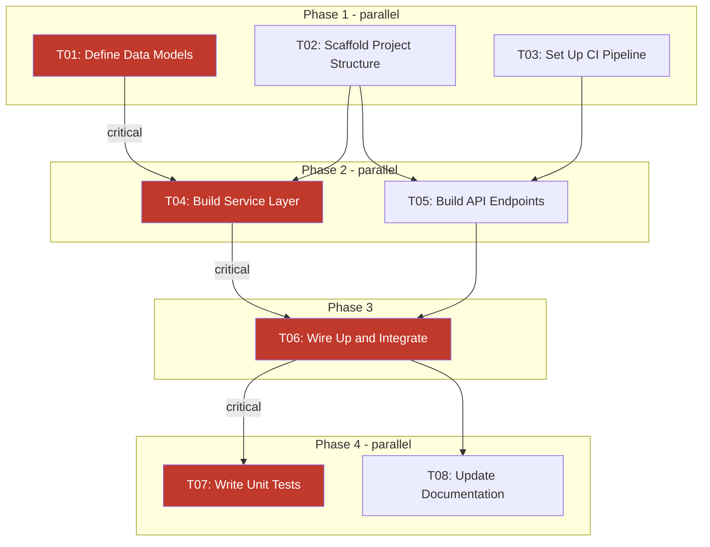

# Implementation Planning Instructions

These instructions tell the reading agent how to generate a
structured Implementation Plan. The preferred input is a completed
EP with Part-1 (proposal) and Part-2 (design details) already
written. A plain task description is also accepted — see
"Output for Standalone Task Descriptions" at the end of this file.

You MUST follow each step in sequence. NEVER skip a step or
produce partial output.

---

## Workflow

### Step 1 — Ingest Input

**If given an EP file path:**

Read the full EP file. Extract and record:

- All components, services, APIs, and modules described in
  Part-2 (Design Details, Infrastructure, Data Migrations,
  Security & Testing sections)
- Acceptance Criteria from Part-1
- Constraints, risks, and dependencies stated anywhere in the EP

If the EP file path is not yet known, STOP and ask:
> "Please provide the path to the EP file (or a task description)
> to generate the implementation plan."

**If given a task description:**

Identify core objectives, expected outcomes, technical scope,
and dependencies on existing code or systems. Skip to Step 2.

### Step 2 — Decompose into Implementation Tasks

Break the content into granular, self-contained tasks. Each
task MUST:

- Produce one verifiable, reviewable change
- Reference specific files it creates or modifies
- Be completable without blocking other agents unless a true
  technical dependency exists

Assign each task:

| Field      | Value                                        |
| ---------- | -------------------------------------------- |
| ID         | `T01`, `T02`, ... `TNN` (sequential)         |
| Title      | Short imperative phrase                      |
| Complexity | `Low` / `Medium` / `High` (see rating guide) |
| Depends On | Comma-separated IDs, or `none`               |
| Files      | List of files created or modified            |

### Step 3 — Build Dependency Graph

Produce a Mermaid `graph TD` diagram from the task list.
Each node MUST use the format `ID["ID: Title"]`. Add an
arrow for every dependency. Mark critical-path edges with
`-->|critical|` and style those nodes in red so the path
is visually distinct. Group tasks into `subgraph` blocks
by phase so parallel tasks are visually obvious.



Replace the example nodes and edges with the actual tasks.
Do not include this example verbatim.

### Step 4 — Compute Execution Phases

Group tasks into phases using these rules:

1. A task enters a phase only when ALL its dependencies have
   been completed in earlier phases.
2. CRITICAL — File-exclusivity: Tasks in the same phase MUST
   NOT modify the same existing file. Two tasks may CREATE
   different new files in the same phase. Only ONE task per
   phase may MODIFY any specific file.
3. Before finalising a phase, check every pair of tasks for
   file conflicts. If a conflict exists, move the
   lower-priority task to the next phase and document the
   reason.

Produce the phase table:

| Phase | Tasks         | Can Parallelise |
| ----- | ------------- | --------------- |
| 1     | T01           | N/A — 1 task    |
| 2     | T02, T03      | Yes             |
| 3     | T04           | N/A — 1 task    |
| 4     | T05, T06, T07 | Yes             |

### Step 5 — Identify Critical Path

The critical path is the longest chain of sequentially
dependent tasks. State it explicitly:

```
Critical path:  T01 → T02 → T04 → T05
Sequential est: N tasks × avg time = X hours
Parallelised:   Y hours  (Z% reduction)
```

Label each critical-path task with `[CRITICAL PATH]` in its
full task definition (Step 6).

### Step 6 — Write Full Task Definitions

For every task, produce a definition using exactly this format.
NEVER omit a field — use `none` or `N/A` if the field does not
apply.

```markdown
#### T01: [Task Title]  [CRITICAL PATH if applicable]

- [ ] [Task Title]
  - Phase: [N]
  - Complexity & Risk: [Low|Medium|High] — [one-line reason]
  - Depends On: [IDs or none]
  - Files:
    - Creates: [path or none]
    - Modifies: [path or none]
  - Description: [What to implement and why — 2-4 sentences.
    Reference the specific EP Part-2 section this satisfies,
    or the task description requirement it addresses.]
  - Acceptance Criteria:
    - [Specific, measurable check]
    - [Specific, measurable check]
  - Testing Requirements:
    - [Specific tests, or "none — trivial change"]
  - In Scope:
    - [Exactly what this task covers]
  - Out of Scope:
    - [What this task explicitly does not cover]

  **Agent Prompt:**
  Context: [EP title or task name] — Phase [N] of [M], Task [ID].
  Your task: [One-paragraph instruction a subagent can execute
  directly. Include: what to implement, which files to touch,
  which existing patterns to follow, and how to confirm
  completion.]
  Constraints: [Any file or scope exclusions.]
  Done when: [Acceptance criteria restated as a self-check list.]
```

### Step 7 — Generate Parallel Dispatch Table

For each phase containing more than one task, produce a dispatch
table showing which agent handles which task:

| Phase | Agent   | Task | Context to pass                  |
| ----- | ------- | ---- | -------------------------------- |
| 2     | Agent-A | T02  | EP Part-2 sections A, B; T01     |
| 2     | Agent-B | T03  | EP Part-2 section C; T01 output  |

**Context to pass** MUST include:

- The relevant EP Part-2 section(s) or task requirement the
  task implements
- The IDs of completed prerequisite tasks and their key outputs
  (e.g., new file paths, schema names, interface definitions)

### Step 8 — Assemble and Write Output

**For EP files:** write under a new `## Implementation Plan`
heading at the end of the EP file.

**For standalone task descriptions:** write to a new file at
`/docs/imp/NNNN-<slug>.md`. Confirm the exact filename with
the user BEFORE creating it.

DO NOT output the plan in chat — write to the file directly.

```markdown
## Implementation Plan

### Technical Analysis

[For EPs: summarise or reference EP Part-2 findings. If Part-2
already contains a comprehensive analysis, write:
"See Part-2 Design Details and Infrastructure sections."
For task descriptions: provide a brief analysis of
architecture impact and affected components.]

### Dependency Graph

[Mermaid diagram from Step 3]

### Execution Phases

[Phase table from Step 4]

**Critical path:** [from Step 5]
**Sequential estimate:** X hours
**Parallelised estimate:** Y hours (Z% reduction)

### Implementation Tasks

[Full task definitions for T01 ... TNN from Step 6,
 ordered by phase then by task ID within each phase]

### Parallel Dispatch Plan

[Dispatch tables from Step 7 for each multi-task phase]

### Definition of Done

- [ ] All implementation tasks completed and checked off
- [ ] All tests passing (unit, integration, e2e as specified)
- [ ] Code review completed
- [ ] Documentation updated
- [ ] Feature verified in staging environment
```

After writing the file, confirm in chat:
> "Implementation plan written to [file path].
> [N] tasks across [M] phases.
> Critical path: [IDs]. Parallelised estimate: Y hours."

---

## Complexity & Risk Rating Guide

| Rating | When to use                                           |
| ------ | ----------------------------------------------------- |
| Low    | Straightforward change, well-understood pattern,      |
|        | minimal dependencies, no architectural impact         |
| Medium | Moderate complexity, some unknowns, touches multiple  |
|        | components or requires cross-cutting changes          |
| High   | Complex logic, significant architectural change, many |
|        | dependencies, or high security / data-integrity risk  |

---

## Validation Checklist

Before confirming the plan is complete, verify all of the
following. If any check fails, fix the issue before writing
the file.

- [ ] Every task has a unique ID (`T01`...`TNN`)
- [ ] Every `Depends On` reference points to a real task ID
- [ ] No circular dependencies exist
- [ ] No two tasks in the same phase modify the same file
- [ ] Every task has a populated `Agent Prompt` section
- [ ] Critical path is identified and labelled
- [ ] All phase tasks have been checked for file conflicts
- [ ] `Definition of Done` checklist is present in the output
