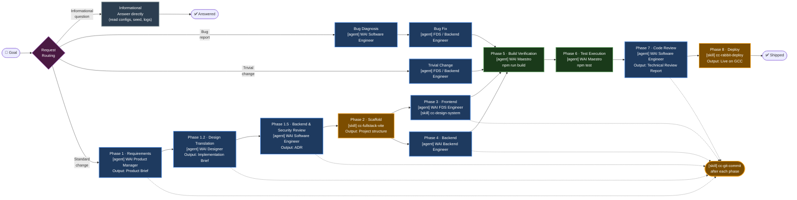

<div align="center">

# WAI

*Full-stack web application delivery — from idea to deployed software in one
orchestrated workflow*

<p align="center">
  <a href="https://vitejs.dev/"></a>
  <a href="https://react.dev/"></a>
  <a href="https://koajs.com/"></a>
  <a href="https://www.postgresql.org/"></a>
</p>

<p align="center">
  
  
</p>

</div>

---

## What This Plugin Does

This plugin turns GitHub Copilot into a **full-stack delivery team** that takes
a product goal from requirements to deployed software. A WAI Maestro
orchestrates a fleet of specialist agents — requirements, architecture, frontend,
backend, and review — across a structured 8-phase SDLC.

The result: An AI team that can frame requirements, produce an architecture
decision record, scaffold a production-ready Vite + Koa + PostgreSQL project,
implement frontend and backend in parallel, run build and test verification,
conduct a principal-level code review, and deploy to GCC via Rabbit Deploy —
with explicit handoff gates between every phase.

---

## What Gets Installed

| File        | Location         | What it does                                                                              |
| ----------- | ---------------- | ----------------------------------------------------------------------------------------- |
| `.agent.md` | `agents/`        | Specialist AI agents covering product, architecture, frontend, backend, and review        |
| `SKILL.md`  | `skills/<name>/` | Domain-knowledge packages — FDS components, project scaffolding, deployment, git workflow |

---

## Agents

### WAI Maestro

Delivery orchestrator that coordinates all 8 SDLC phases. Routes incoming
requests through a **Request Routing** classifier — informational questions
are answered directly, bugs go through diagnosis before fix, trivial changes
skip PM and architecture review, and standard features run the full pipeline.
Delegates to the right specialist at the right time, enforces phase gates,
runs automated build and test verification, and produces a git commit after
each phase.

**SDLC phases:**

| Phase | Name                      | Owner                     |
| ----- | ------------------------- | ------------------------- |
| 1     | Requirements              | WAI Product Manager       |
| 1.3   | Design Translation        | WAI Designer              |
| 1.5   | Backend & Security Review | WAI Software Engineer     |
| 2     | Scaffold                  | `cc-fullstack-vite` skill |
| 3     | Frontend                  | WAI FDS Engineer          |
| 4     | Backend                   | WAI Backend Engineer      |
| 5     | Build Verification        | WAI Maestro (automated)   |
| 6     | Test Execution            | WAI Maestro (automated)   |
| 7     | Code Review               | WAI Software Engineer     |
| 8     | Deploy                    | `cc-rabbit-deploy` skill  |

**Orchestration flow:**



**Example prompts:**

- "Build me a task management app with a React frontend and REST API."
- "Take this product brief and deliver a working prototype."
- "Scaffold, build, and deploy a PostgreSQL-backed dashboard."

### WAI Product Manager

Guides requirements gathering, MVP scoping, and user story writing for
non-technical users. Produces a structured Product Brief that feeds
directly into Phase 1.5 Architecture Review.

**Example prompts:**

- "Help me scope an MVP for a leave management tool."
- "Turn these user needs into a product brief."
- "What features should be in v1 vs. a later release?"

### WAI Software Engineer

Principal-level engineer operating at the two highest-leverage points in
the SDLC: architecture review (Phase 1.5) and code review (Phase 7). Also
available standalone for EP authoring and implementation planning.

**Phase 1.5 — Architecture Review:**

- Evaluates the Product Brief and produces an Architecture Decision Record
  (ADR) covering stack, data model, API design, security posture, and
  deployment constraints.
- ADR modifications are applied to implementation briefs before Phases 3
  and 4 begin.

**Phase 7 — Code Review:**

- Runs a principal-level technical review covering correctness, FDS
  compliance, security (OWASP Top 10), performance, and test coverage.
- Produces a structured Technical Review Report.

**Standalone skills:**

- `cc-create-ep` — EP authoring with parallel codebase research subagents
- `cc-plan-implementation` — parallelised workplan with Mermaid dependency
  graph and per-task agent prompts

### WAI FDS Engineer *(subagent)*

Frontend specialist that implements pages and components using FDS components,
tokens, and theming patterns. Operates in Phase 3 under Maestro direction.

### WAI Backend Engineer *(subagent)*

Backend specialist that implements Koa routes, database migrations, and
middleware. Operates in Phase 4 under Maestro direction.

### Prompt Refiner *(subagent)*

Rewrites vague prompts into specific, execution-ready instructions and
explains the prompt-engineering improvements applied. Invoked automatically
by user-facing agents — not user-facing itself.

---

## Skills

Skills are loaded on demand when semantically matched to the current task.
No manual loading is needed.

### `cc-fullstack-vite`

Scaffolds a complete Vite + React + FDS frontend with Koa + TypeScript
backend and PostgreSQL database in a single project folder. Used by
WAI Maestro in Phase 2.

**Key capabilities:**

- Template-based project creation with token substitution for port and
  database name
- Produces the exact `dist/index.js` and `dist/client/` build outputs
  required by the production Dockerfile
- Sets up Docker Compose for local PostgreSQL, gitleaks pre-commit hook,
  and all TypeScript configs

### `cc-design-system`

Activated when Copilot needs to look up FDS component usage, tokens,
theming, or accessibility patterns. Includes a full component catalogue,
design token reference, layout composition patterns, and theme setup
guide. Used by WAI FDS Engineer.

### `cc-vite-react-ds`

Scaffolds a frontend-only Vite + React + FDS project. Used by WAI FDS
Engineer when a backend is not required.

### `cc-rabbit-deploy`

Covers GCC deployment via Rabbit Deploy — git initialisation, Project
Access Token setup, configuring the GitLab remote, and pushing to trigger
automatic CI/CD. Used by WAI Maestro in Phase 8.

### `cc-git-commit`

Atomic commit workflow that groups changed files into logical commits and
produces Conventional Commit messages prefixed with branch name and author
initials. Used by WAI Maestro after each SDLC phase.

### `cc-create-ep`

Stepwise Enhancement Proposal (EP) creation following KEP-style
documentation standards. Fires 5 specialist research subagents in parallel
to gather codebase context. Used by WAI Software Engineer in standalone
mode.

### `cc-plan-implementation`

Decomposes an EP or task description into a parallelised, phase-based
workplan with a Mermaid dependency graph, critical path analysis, and
per-task agent prompts. Used by WAI Software Engineer in standalone mode.

### `cc-contribute-wai`

Hands-on guide for contributing to or improving the ccube agent plugin
marketplace. Walks contributors through the full workflow: environment
check, branching, creating or editing skills/agents/instructions,
marketplace.json registration, testing via VS Code reload, committing,
pushing, and creating merge requests. Designed for contributors of all
technical levels, including product managers and designers.

---

## Telemetry

This plugin collects anonymous usage data to help understand how many
people install it and which agents are used most. No PII, file contents,
or workspace data is ever collected.

**What is sent on each session start:**

- A random anonymous ID (generated locally at
  `~/.ccube/telemetry-id`, reused across sessions)
- The plugin name
- The agent name (e.g. `maestro`)
- A UTC timestamp

**How to opt out:**

Add the following to your shell profile (`~/.zshrc`, `~/.bashrc`,
or `~/.profile`) and restart VS Code:

```bash
export CCUBE_TELEMETRY_DISABLED=1
```

See [docs/telemetry/DESIGN.md](../../docs/telemetry/DESIGN.md) for
the full privacy and data schema documentation.

---

## Requirements

- Node.js 18+
- Docker + Docker Compose (for local PostgreSQL)
- gitleaks (`brew install gitleaks`)
- pre-commit (`brew install pre-commit`)
