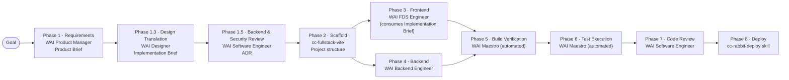

# WAI Designer — WAI Integration Recommendation

> Status: Proposal (not yet implemented)
> Author: Configuration Engineer analysis, 2026-04-20
> Target: `fullstack-skill` worktree — WAI plugin

---

## Executive Summary

WAI Designer is a visual design translation agent that reads Figma files and design
briefs, maps them to FDS components and tokens, runs WCAG 2.1 AA accessibility
evaluation, and produces structured Implementation Briefs. It is a precision-fit for
a gap that exists in the WAI AI SDLC today: the WAI FDS Engineer is currently expected
to make all visual, layout, and accessibility decisions simultaneously while writing
TypeScript and React. WAI Designer moves that responsibility earlier — before a line of
code is written — lowering rework cost and raising FDS compliance accuracy.

**Recommendation: integrate WAI Designer as Phase 1.3 — Design Translation (before Architecture Review), with three targeted changes to the existing WAI plugin.**

---

## 1. The Gap in the Current WAI SDLC

The current 8-phase SDLC has no dedicated design checkpoint:

| Phase | Name                | Owner                     |
| ----- | ------------------- | ------------------------- |
| 1     | Requirements        | WAI Product Manager       |
| 1.5   | Architecture Review | WAI Software Engineer     |
| 2     | Scaffold            | `cc-fullstack-vite` skill |
| 3     | Frontend            | WAI FDS Engineer          |
| 4     | Backend             | WAI Backend Engineer      |
| 5     | Build Verification  | WAI Maestro (automated)   |
| 6     | Test Execution      | WAI Maestro (automated)   |
| 7     | Code Review         | WAI Software Engineer     |
| 8     | Deploy              | `cc-rabbit-deploy` skill  |

WAI FDS Engineer receives:
- A product-level Frontend Implementation Brief from Phase 1
- Architecture Decision Record (ADR) notes from Phase 1.5

It must then independently: select FDS components, choose layout patterns, apply
token values, satisfy ARIA requirements, and check WCAG 2.1 AA compliance — all
while writing the actual code. Component mismatches, layout inconsistencies, and
accessibility failures currently surface at **Phase 7 — Code Review**, after all
frontend code is written. Fixing them at that point is expensive.

---

## 2. Where WAI Designer Slots In

WAI Designer inserts as **Phase 1.3 — Design Translation**, immediately after
Requirements and before Architecture Review:

```
Phase 1   → Product Brief             (WAI Product Manager)
                    |
                    ▼
Phase 1.3 → Implementation Brief      (WAI Designer)  ← NEW
                    |
                    ▼
Phase 1.5 → Backend & Security ADR    (WAI Software Engineer — narrowed scope)
                    |
                    ▼
Phase 2   → Scaffold                  (cc-fullstack-vite skill)
Phase 3   → Frontend                  (WAI FDS Engineer, consumes Implementation Brief)
Phase 4   → Backend                   (WAI Backend Engineer — unchanged)
...
```

WAI Designer receives the Product Brief and any Figma URL
the user has shared. It produces a structured **Implementation Brief** containing:

- Every screen's FDS component list in DOM order — exact component names, required
  props, token override values
- **Component architecture review** (FDS layer): justification for each component
  selection, component boundary decisions, and composition patterns — scope
  previously held by the Phase 1.5 ADR
- Layout pattern selections (from `layout-composition-patterns.md`) with trade-off
  notes for non-trivial decisions
- ARIA requirements per component
- Responsive breakpoint behavior keyed to FDS breakpoint tokens
- WCAG 2.1 AA assessment — Failures are **hard blockers** before Phase 1.5 begins
- "No FDS Coverage" gaps flagged for WAI Software Engineer custom component review

WAI FDS Engineer then implements directly from this brief, making no independent
visual or accessibility decisions.

**Shift-left benefit:** WCAG 2.1 AA Failures become a spec blocker at Phase 1.3
instead of a code review finding at Phase 7. Remediation is a spec edit, not a
code rewrite.

---

## 3. Changes Required

### 3.1 WAI Maestro (`agents/maestro.agent.md`) — 6 targeted edits

#### a) Add `"WAI Designer"` to the `agents:` frontmatter

```yaml
agents:
  - "WAI Product Manager"
  - "WAI Designer"              # add
  - "WAI FDS Engineer"
  - "WAI Backend Engineer"
  - "WAI Software Engineer"
  - "Prompt Refiner"
```

#### b) Insert Phase 1.3 between Phase 1 and Phase 1.5

Add the following section after the Phase 1.5 section and before the Phase 2
section:

```markdown
### Phase 1.3 — Design Translation

Delegate to **WAI Designer**.

Provide the complete Product Brief and any Figma URL the user has shared. WAI Designer will:
- Map every visual element to its exact FDS component, required props, and tokens
- Own component architecture at the FDS layer: justify each component selection,
  define component boundaries, and document composition patterns
- Select layout patterns for each page region
- Evaluate WCAG 2.1 AA compliance — Failures are hard blockers before Phase 1.5 begins
- Return a structured Implementation Brief for WAI FDS Engineer

Gate condition: WAI Designer MUST return an Implementation Brief with no unresolved
WCAG 2.1 AA Failures before Phase 1.5 begins. If Failures are present, WAI Designer
will propose FDS-compliant alternatives. Present these to the user for confirmation
before proceeding.

If WAI Designer flags a "No FDS Coverage" gap, escalate to the user and route the
gap description to WAI Software Engineer for custom component review before Phase 3.

Tell the user:
> "I'm sending the plan to the design specialist — they'll map every screen to FDS
> components, check accessibility, and produce a build-ready brief for the frontend
> engineer."

Present a plain-language summary of the Implementation Brief to the user: screen
count, components mapped, layout patterns chosen, accessibility findings resolved,
any coverage gaps flagged.
```

#### c) Narrow Phase 1.5 scope to backend and security

The WAI Software Engineer's Architecture Review currently includes FDS component
selections and component architecture as part of its review scope. With WAI Designer
owning those decisions from Phase 1.3, that scope is removed from Phase 1.5.

Update the Phase 1.5 section in `maestro.agent.md` to:
- Remove the following from the ADR scope (now owned by WAI Designer in Phase 1.3):
  - FDS component selection review
  - Component architecture (FDS layer) — component boundaries and composition patterns
- Add the Implementation Brief from Phase 1.3 as an additional input (for
  cross-cutting concerns — e.g., a layout pattern with performance implications)
- Explicitly scope the ADR output to: data model, API contract, security posture,
  and performance risks — not visual architecture

All scope items removed from Phase 1.5 are explicitly covered by WAI Designer in
Phase 1.3. The Implementation Brief delivered by Phase 1.3 is the authoritative
frontend architecture record; the Phase 1.5 ADR does not re-evaluate it.

Update the WAI Software Engineer Architecture Review brief template to add:

    Implementation Brief: [complete Implementation Brief from Phase 1.3]
    Review scope: data model, API contract, security posture, performance risks only.
    Do not re-evaluate FDS component selections — those are owned by WAI Designer.

---

#### d) Add a WAI Designer delegation template

Add the following to the `## Delegation Templates` section:

```markdown
### WAI Designer brief

​```
Product Brief: [complete Product Brief from Phase 1]
Figma URL: [user's Figma URL, or "none provided"]
Target audience: React Engineer
​```
```

#### e) Update the WAI FDS Engineer brief template

Replace:

```
Frontend brief: [relevant section from Product Brief]
FDS constraints: [any known constraints from prior review]
```

With:

```
Implementation brief: [complete Implementation Brief from Phase 1.3]
# The brief already contains FDS component selections, props, token values,
# ARIA requirements, and layout patterns. Do not deviate without flagging back.
```

#### f) Update the SDLC phase table and Mermaid diagram

Insert Phase 1.3 row in the table (before Phase 1.5) and add the corresponding
nodes and edges in the Mermaid `flowchart LR` diagram:

```
P13["Phase 1.3 · Design Translation\n[agent] WAI Designer\nOutput: Implementation Brief"]:::agent
```

Edges: `P1 --> P13 --> P15 --> P2` (replacing the existing `P1 --> P15 --> P2` edge)

Also update the Phase 1.5 node label to reflect narrowed scope:

```
P15["Phase 1.5 · Backend & Security Review\n[agent] WAI Software Engineer\nOutput: ADR"]
```

---

### 3.2 WAI Designer (`cc-designer.agent.md`) — 2 targeted edits

#### a) Add mode detection

WAI Designer currently runs in a single interactive mode — Prompt Refiner fires,
clarifying questions are asked, the user confirms layout trade-off options. When
invoked by WAI Maestro with a structured brief, this interactive loop is
unnecessary overhead and would break the orchestration flow.

Add a `## Mode Detection` section (modelled on WAI Software Engineer's existing
mode detection pattern) immediately after `## Priority Hierarchy`:

```markdown
## Mode Detection

Detect operating mode from the input shape:

| Signal in input                                                            | Mode       |
| -------------------------------------------------------------------------- | ---------- |
| Contains `Product Brief:` field in a structured brief from WAI Maestro     | Subagent   |
| Free-form user message, Figma URL, or design description without the above | Standalone |

**Standalone mode** (default — invoked directly by a user):
Full interactive workflow. Invoke Prompt Refiner unconditionally. Ask one
clarifying question at a time. Present layout trade-off options before recommending.
Require user confirmation before calling any Figma write operation.

**Subagent mode** (invoked by WAI Maestro with a structured brief):
Produce the complete Implementation Brief in a single response. Do NOT invoke
Prompt Refiner. Do NOT ask intermediate clarifying questions. If a WCAG 2.1 AA
Failure is identified, include it in the returned brief with a proposed
FDS-compliant alternative — flag it for Maestro to escalate to the user. Return
the Implementation Brief using the Phase 5 spec table format.
```

#### b) Add `"WAI FDS Engineer"` to the `agents:` frontmatter

WAI Designer's current `agents:` list references `"CC React Engineer"` as the
implementation handoff target. In the WAI context the recipient is
`"WAI FDS Engineer"`. Add it alongside the existing entry — Maestro controls
which agent receives the brief; WAI Designer only produces it.

```yaml
agents:
  - "Prompt Refiner"
  - "CC React Engineer"
  - "WAI FDS Engineer"       # add
  - "CC Software Engineer"
  - "WAI Software Engineer"  # add — for data dependency questions
```

No changes to the handoff targets in the frontmatter `handoffs:` block are
required. The "Generate FDS Component Map" handoff label remains valid — Maestro
intercepts the brief before it reaches any implementation agent.

---

## 4. What Does NOT Change

The following must remain unchanged to avoid regression:

| Item                                                                | Why unchanged                                                                                 |
| ------------------------------------------------------------------- | --------------------------------------------------------------------------------------------- |
| Phases 2, 3, 4, 5, 6, 7, 8 — purpose and ownership                  | Only Phase 3's input brief changes                                                            |
| WAI FDS Engineer implementation rules                               | It gains a better input, not new responsibilities                                             |
| WAI Designer standalone interactive behavior                        | Mode detection is additive; standalone path is preserved                                      |
| `cc-design-system` skill resource loading order inside WAI Designer | Phase 3 FDS mapping logic is unchanged                                                        |
| Phase 1.5 Architecture Review                                       | Scope narrowed to backend/security (Section 3.1c); FDS component selection moves to Phase 1.3 |
| WAI Backend Engineer — all phases                                   | No dependency on design translation                                                           |

---

## 5. Updated SDLC Phase Table

| Phase   | Name                      | Owner                     | Output                       |
| ------- | ------------------------- | ------------------------- | ---------------------------- |
| 1       | Requirements              | WAI Product Manager       | Product Brief                |
| **1.3** | **Design Translation**    | **WAI Designer**          | **Implementation Brief**     |
| 1.5     | Backend & Security Review | WAI Software Engineer     | Architecture Decision Record |
| 2       | Scaffold                  | `cc-fullstack-vite` skill | Project structure            |
| 3       | Frontend                  | WAI FDS Engineer          | React + FDS pages            |
| 4       | Backend                   | WAI Backend Engineer      | Koa routes + DB migrations   |
| 5       | Build Verification        | WAI Maestro (automated)   | Build pass/fail              |
| 6       | Test Execution            | WAI Maestro (automated)   | Test pass/fail               |
| 7       | Code Review               | WAI Software Engineer     | Technical Review Report      |
| 8       | Deploy                    | `cc-rabbit-deploy` skill  | Deployed application         |

---

## 6. Updated Orchestration Flow (Mermaid)



Phase 1.3 is sequential (must complete before Phase 1.5 begins) because the
Implementation Brief is a hard input dependency for both the ADR (cross-cutting
performance/security review) and WAI FDS Engineer.

---

## 7. Risks and Mitigations

| Risk                                                                            | Mitigation                                                                                                                                                                       |
| ------------------------------------------------------------------------------- | -------------------------------------------------------------------------------------------------------------------------------------------------------------------------------- |
| Phase 1.3 adds latency — user waits for spec before Architecture Review         | Benefit offsets cost: FDS Engineer implements faster with less ambiguity; ADR can review real component choices; WCAG Failure remediation at spec stage costs seconds, not hours |
| No Figma URL provided — WAI Designer works from written brief only              | WAI Designer explicitly handles this (Workflow Phase 1 Step 3–4); Implementation Brief quality is lower but still valid for FDS mapping                                          |
| "No FDS Coverage" gap identified at Phase 1.3                                   | Maestro escalates to user; routes to WAI Software Engineer for custom component review before Phase 1.5 proceeds                                                                 |
| WAI Designer invokes Prompt Refiner in subagent mode (adds round-trip overhead) | Mode detection change (Section 3.2a) prevents Prompt Refiner invocation in subagent mode                                                                                         |
| WAI Designer lives in personal copilot config, not inside the WAI plugin        | WAI Maestro references agents by registered name. WAI Designer is globally registered; no plugin move required unless WAI is packaged for distribution to other users            |
| WCAG Failure found at Phase 1.3 — blocks Phase 1.5 and Phase 3                  | This is by design. Blocking at spec costs far less than post-code remediation. Maestro surfaces the failure and FDS alternative to the user for a quick confirmation             |

---

## 8. Integration Effort Estimate

| Change item                                          | Effort                       |
| ---------------------------------------------------- | ---------------------------- |
| Maestro: add `WAI Designer` to `agents:` frontmatter | 1 line                       |
| Maestro: insert Phase 1.3 section                    | ~25 lines                    |
| Maestro: narrow Phase 1.5 scope to backend/security  | ~5 lines                     |
| Maestro: add WAI Designer delegation template        | ~6 lines                     |
| Maestro: update WAI FDS Engineer brief template      | ~5 lines (2 replaced)        |
| Maestro: update SDLC table + Mermaid diagram         | ~10 lines                    |
| WAI Designer: add mode detection section             | ~20 lines                    |
| WAI Designer: add WAI FDS Engineer to `agents:`      | 2 lines                      |
| **Total**                                            | **~74 lines across 2 files** |

No new agents, skills, hooks, or plugin manifests are required.

---

## 9. Files to Modify

| File                                       | Change                     |
| ------------------------------------------ | -------------------------- |
| `plugins/wai/agents/maestro.agent.md`      | Sections 3.1a – 3.1f above |
| `plugins/wai/agents/wai-designer.agent.md` | Sections 3.2a – 3.2b above |

No other files need modification.
